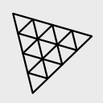
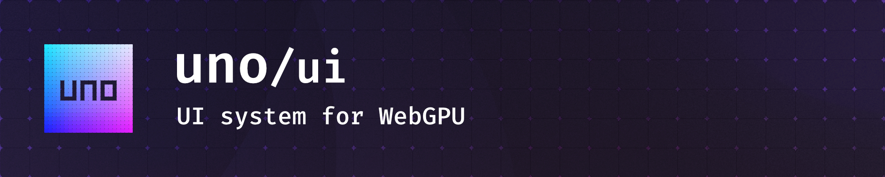

    
    
    
    
    
    
    
    
    
     
 

 

**[Website](https://uno.build/) • [API Docs](https://uno.build/docs/) • [Examples](https://uno.build/docs/examples/)**

#### Build high-performance and pixel-perfect user interfaces for WebGPU. Use the rendering engine and UI framework of your choice.

## Motivation

When you build a video game's UI with a library such as Three.js, you typically use HTML and CSS for the layout. This approach has two drawbacks. First, it ties your game to the web, so you must ship it for browsers, Electron, or another environment with a WebView. Second, it separates your UI from your game because they live in two different worlds.

uno UI solves both problems by rendering the UI directly through the game's rendering pipeline, without relying on HTML or the DOM. This lets your game run in non-web environments while keeping the UI and game in the same rendering system.

## Key Features

- Works with any WebGPU rendering engine
- Use it standalone or with [React](https://uno.build/examples/react/), [Vue](https://uno.build/examples/vue/) or [SolidJS](https://uno.build/examples/solid/)
- World-space integrations for [Three.js](https://uno.build/examples/engines/three-worldspace.html), [Babylon.js](https://uno.build/examples/engines/babylon-worldspace.html), [Babylon Lite](https://uno.build/examples/engines/babylonlite-worldspace.html) and [PlayCanvas](https://uno.build/examples/engines/playcanvas-worldspace.html)
- [Pixel-perfect parity with DOM rendering](https://uno.build/examples/layouts/)
- High-quality text rendering with strokes and shadows using [MTSDF](https://github.com/Chlumsky/msdf-atlas-gen)
- Accurate text measurement and layout powered by [Pretext](https://github.com/chenglou/pretext)
- Flexbox layout powered by [Yoga](https://www.yogalayout.dev/)
- Fine-grained updates for efficient rendering
- Lightweight, basic setup is around 280kb (93kb gzip)

## Examples

#### These examples illustrate how to combine two independent UIs, one in the background and one in the foreground, with the engine’s scene rendered between them.

- [WebGPU](https://uno.build/examples/engines/webgpu.html)
- [Three.js](https://uno.build/examples/engines/three.html)
- [Pixi.js](https://uno.build/examples/engines/pixi.html)
- [Babylon.js](https://uno.build/examples/engines/babylon.html)
- [Babylon Lite](https://uno.build/examples/engines/babylonlite.html)
- [PlayCanvas](https://uno.build/examples/engines/playcanvas.html)
- [TypeGPU](https://uno.build/examples/engines/typegpu.html)

#### The background UI shown above can also be placed in world space. Each example includes lighting to demonstrate how it integrates with the 3D scene.

- [Three.js](https://uno.build/examples/engines/three-worldspace.html)
- [Babylon.js](https://uno.build/examples/engines/babylon-worldspace.html)
- [Babylon Lite](https://uno.build/examples/engines/babylonlite-worldspace.html)
- [PlayCanvas](https://uno.build/examples/engines/playcanvas-worldspace.html)

#### UI frameworks.

- [React](https://uno.build/examples/react/): Includes a demo showing the to-do app integrated into a Three.js scene.
- [Vue](https://uno.build/examples/vue/): Includes a demo showing the to-do app integrated into a PlayCanvas scene.
- [SolidJS](https://uno.build/examples/solid/): Includes a demo showing the to-do app integrated into a Babylon Lite scene.
